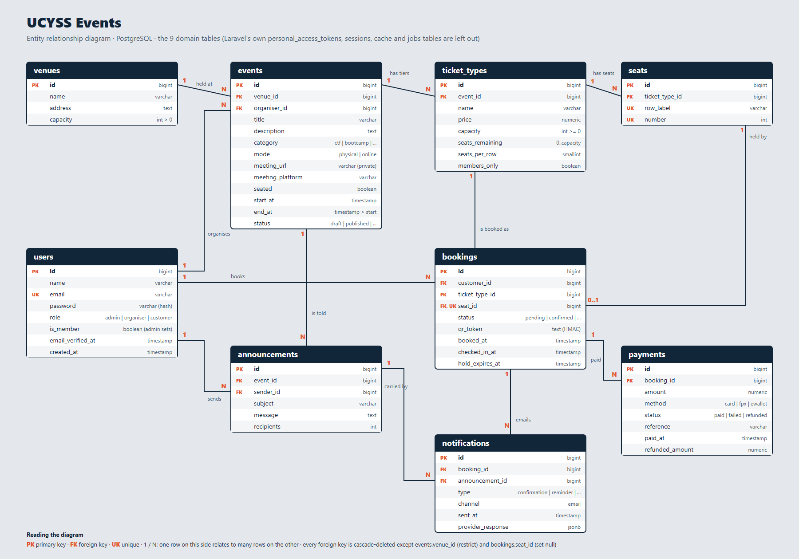
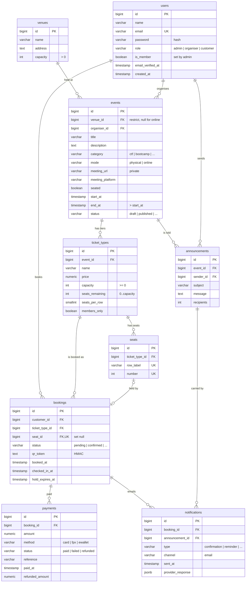

# UCYSS Events (SentryPass)

Event ticketing and venue booking for the UPTM Cybersecurity Student Society (UCYSS): CTFs, bootcamps, conferences and workshops, in person or online. One Laravel API, a web app for customers, organisers and admins, and a customer mobile app.

## What it does

- **Customers** browse events, book free or paid passes (sandbox payments with a timed seat hold), pick seats on a 3D map, join a waitlist, get a signed QR pass, join online meetings, add events to their calendar, share on WhatsApp and download a certificate of attendance.
- **Organisers** create and publish events (in person or online), manage ticket tiers (including members-only), see a live seat map, check guests in by scanning QR codes, send announcements and see who came and who did not.
- **Admins** see the whole programme: revenue, bookings, people, venues, the email log and attendance, with refunds, cancellations and exports.
- **Everything updates live** (no refresh), reminder emails go out a day before an event, and the web and mobile apps follow light, dark or automatic themes.

## Database design

Nine domain tables in PostgreSQL. Full detail (columns, constraints, sample data) is in [`docs/database.md`](docs/database.md).



<details>
<summary>The same diagram as Mermaid code</summary>



</details>

## Project layout

```
SentryPass/
├── backend/                 Laravel 12 API (Sanctum, PostgreSQL via Sail)
├── frontend/
│   ├── web/                 One web app for every role   React + Vite
│   └── customer-mobile/     Customer Mobile App   React Native + Expo
├── docs/                    API reference, ERD and database design, Postman collection, project spec
└── README.md
```

| App | Folder | Stack | Dev URL |
| --- | --- | --- | --- |
| API | `backend/` | Laravel 12, Sanctum, PostgreSQL | http://localhost/api |
| Web app (customer, organiser, admin) | `frontend/web/` | React + Vite | http://localhost:5175 |
| Customer Mobile | `frontend/customer-mobile/` | React Native + Expo | Expo Go / emulator |

## Documentation

Everything is in [`docs/`](docs/README.md):

- [API reference](docs/api-documentation.md): every endpoint with examples
- [Database design](docs/database.md): ERD, tables, constraints, sample data
- [Postman collection](docs/postman/README.md): 198 requests, 309 assertions, runnable with Newman

## Run the API

```bash
cd backend
cp .env.example .env            # Windows: uncomment WWWUSER / WWWGROUP in .env
docker compose up -d
docker compose exec -u root laravel.test chown sail:sail vendor
docker compose exec -u sail laravel.test composer install   # vendor/ lives on a Docker volume (fast on Windows)
docker compose restart laravel.test
docker compose exec laravel.test php artisan key:generate
docker compose exec laravel.test php artisan migrate:fresh --seed
```

`vendor/` sits on a named volume because reading it through the Windows bind mount made every request take 8-20 seconds.

Seeded accounts (password `password` for all): `admin@sentrypass.test` (admin), `aisyah@ucyss.test` and `farid@ucyss.test` (organisers), `customer@sentrypass.test` (a demo customer) and 40 named students such as `adam.iskandar@ucyss.test`. The seed is a small UCYSS programme: two online sessions, a seated CTF, a paid bootcamp with a waitlist, a free career talk, a draft, a cancelled event and a finished one. Dates are counted from the day you seed, so the events are always coming up. (`migrate:fresh` erases the database first.)

Optional `.env` settings: `MAIL_API_DRIVER` (`resend` or `brevo`) with `RESEND_API_KEY` or `BREVO_API_KEY` and `BREVO_FROM_EMAIL` (real emails; without them notifications are recorded as skipped) and `CHECKIN_API_KEY` (shared key for scanning devices sending `X-Api-Key`).

## Run a frontend

```bash
cd frontend/web
npm install
npm run dev
```

The web app is one application with one sign-in page. After signing in, the role decides where you land: customers in the public site (`/passes`), organisers in `/organiser`, admins in `/admin`. Each area has its own layout and route guard, and the API enforces the same roles on every request. The API address comes from `VITE_API_URL`, defaulting to `http://localhost/api`.

Mobile:

```bash
cd frontend/customer-mobile
npm install
npx expo start
```

Set `EXPO_PUBLIC_API_URL` when the app can't reach `localhost`: `http://10.0.2.2/api` for an Android emulator, or `http://<your-computer-LAN-IP>/api` for a physical phone on the same Wi-Fi.

## Tests and continuous integration

| What | How to run it here |
| --- | --- |
| Backend (PHPUnit, real PostgreSQL) | `cd backend && docker compose exec laravel.test php artisan test` |
| Browser tests (Playwright; needs the API and the web app running) | `cd frontend/web && npx playwright test` |
| API collection (Newman) | `npx newman run docs/postman/SentryPass.postman_collection.json -e docs/postman/SentryPass.local.postman_environment.json --env-var "checkin_api_key=<your CHECKIN_API_KEY>"` |

`.github/workflows/ci.yml` runs on every push and pull request, in four separate jobs: the backend tests against a PostgreSQL service, the web app's type-check, lint and build, the mobile app's type-check, and the Postman collection against a freshly seeded API (`php artisan serve`). The browser tests are not part of CI, because they need the whole stack running together.
