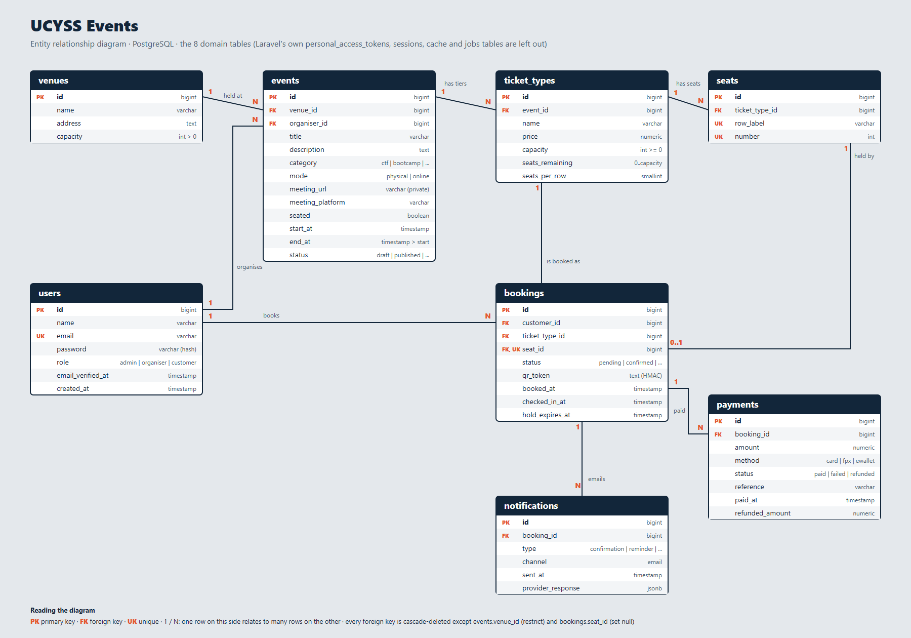

# Database design

UCYSS (the code is still called SentryPass) uses **PostgreSQL 18**. The schema is created by Laravel migrations (`backend/database/migrations`). Three files here describe it on their own, for anyone who wants to build the database without Laravel:

| File | What it is |
| --- | --- |
| [`ERD.png`](ERD.png) / [`ERD.svg`](ERD.svg) | Entity relationship diagram of the eight domain tables |
| [`database/schema.sql`](database/schema.sql) | **DDL**: the exact `CREATE TABLE`, constraints, indexes and foreign keys, exported with `pg_dump` |
| [`database/sample-data.sql`](database/sample-data.sql) | **DML**: sample rows, at least five in every table |



## Tables

| Table | What a row is | Key columns |
| --- | --- | --- |
| `users` | A person who can sign in | `role` is `admin`, `organiser` or `customer` (default `customer`); `email` is unique |
| `venues` | A place events can be held | `capacity` must be greater than 0. One venue named "Online" is shared by every online event |
| `events` | A CTF, bootcamp, conference or workshop | `category`, `status` (`draft` → `published` → `completed` / `cancelled`), `mode` (`physical` or `online`), `seated`, `venue_id`, `organiser_id`; `meeting_url` and `meeting_platform` for an online event |
| `ticket_types` | A tier of an event, such as Early Bird or VIP | `price`, `capacity`, `seats_remaining`, `seats_per_row` |
| `seats` | One numbered seat of a tier (only on a `seated` event) | `row_label` and `number`, unique within the tier |
| `bookings` | One customer's place on one tier | `status` (`pending`, `confirmed`, `waitlisted`, `attended`, `cancelled`), `seat_id`, `qr_token` (HMAC-signed ticket), `hold_expires_at` (the payment hold), `booked_at`, `checked_in_at` |
| `payments` | One payment attempt for a booking | `amount`, `method` (`card`, `fpx`, `ewallet`), `status` (`paid`, `failed`, `refunded`), `refunded_amount` |
| `notifications` | An email owed to a customer | `type` (`confirmation`, `waitlist_promoted`, `cancelled`, `reminder`), `sent_at`, `provider_response` (raw JSON from the email API) |

Laravel also creates `personal_access_tokens` (Sanctum), `sessions`, `cache`, `jobs` and `migrations`; they are not part of the domain model and are left out of the diagram.

## Relationships and delete rules

| Child → parent | Cardinality | On delete | Why |
| --- | --- | --- | --- |
| `events.venue_id` → `venues` | many events per venue | **restrict** | A venue that still has events can't be removed |
| `events.organiser_id` → `users` | many events per organiser | cascade | Removing an organiser removes their events |
| `ticket_types.event_id` → `events` | many tiers per event | cascade | Tiers belong to their event |
| `seats.ticket_type_id` → `ticket_types` | many seats per tier | cascade | Seats belong to their tier |
| `bookings.customer_id` → `users` | many bookings per customer | cascade | |
| `bookings.ticket_type_id` → `ticket_types` | many bookings per tier | cascade | |
| `bookings.seat_id` → `seats` | at most one booking per seat | **set null** | Removing a seat keeps the booking |
| `payments.booking_id` → `bookings` | many payment attempts per booking | cascade | |
| `notifications.booking_id` → `bookings` | many emails per booking | cascade | |

## Constraints enforced by the database

| Rule | Constraint |
| --- | --- |
| A venue holds at least one person | `venues_capacity_check`: `capacity > 0` |
| An event ends after it starts | `events_end_after_start_check`: `end_at > start_at` |
| An event is physical or online | `events_mode_check` |
| Tier capacity is not negative | `ticket_types_capacity_check`: `capacity >= 0` |
| Seats left are between 0 and capacity | `ticket_types_seats_remaining_check`: `seats_remaining >= 0 AND seats_remaining <= capacity` |
| A seat exists once per tier | unique `(ticket_type_id, row_label, number)` |
| A seat is held by at most one booking | `bookings_seat_id_unique` |
| Allowed values | `users_role_check`, `events_category_check`, `events_status_check`, `bookings_status_check`, `notifications_type_check`, `notifications_channel_check` |
| One account per email | unique index on `users.email` |

The `seats_remaining <= capacity` and `>= 0` checks, and the unique seat, are the last line of defence for the booking race condition: even if application code were wrong, the database refuses to oversell a tier or seat the same seat twice.

## Indexes

PostgreSQL does not index a foreign key by itself, so the migration `2026_09_20_130000_add_query_indexes.php` adds the indexes the API's queries use (for a customer's bookings, the admin lists, the waitlist queue, the hold sweep, the event list). What they changed, measured on 80,000 bookings, is in [`performance/PERFORMANCE.md`](performance/PERFORMANCE.md).

## Rules enforced in the application, not the database

- A customer can't hold two active (`pending`, `confirmed` or `waitlisted`) bookings on the same ticket type. `BookingService::book()` checks this inside the same transaction that locks the tier row (`lockForUpdate()`), so two simultaneous requests can't both slip through.
- An online event has no seats, no venue of its own and needs a meeting link before it can be published. The link is never put in a response for anyone but the organiser, an admin, and (through the join call) a confirmed guest.
- A draft event is visible only to its organiser and admins, and a draft, cancelled or finished event cannot be booked.

## Sample data (DML)

There are two ways to get data:

1. **`sample-data.sql`**: a small, readable set with fixed ids, for the report and for loading into any PostgreSQL database.
2. **`php artisan migrate:fresh --seed`**: a UCYSS programme from `UcyssDemoSeeder` (8 events, 40 students, 119 bookings, 37 payments, 32 seats). Dates are counted from the day you seed. The rows in the email log say honestly that no email was sent.

| Table | Rows in `sample-data.sql` | Mix |
| --- | --- | --- |
| `users` | 8 | 1 admin, 2 organisers, 5 customers |
| `venues` | 6 | "Online" plus five UPTM places |
| `events` | 7 | Online and in person, every status (draft, published, completed, cancelled) |
| `ticket_types` | 10 | Free and paid tiers, one sold out |
| `seats` | 18 | Numbered seats for the seated CTF |
| `bookings` | 12 | Every status, one with a payment hold, seated and unseated |
| `payments` | 6 | Paid by card, FPX and e-wallet, one refunded, two declined |
| `notifications` | 7 | Every email type, including a reminder and a refused one |

The demo password for every account is `password`.

`sample-data.sql` was checked by loading `schema.sql` and then `sample-data.sql` into an empty PostgreSQL database: no errors, and 8, 6, 7, 10, 18, 12, 6 and 7 rows.

## Regenerating the files

```bash
cd backend
# DDL
docker compose exec -T pgsql pg_dump -U sail -d laravel --schema-only --no-owner --no-privileges \
  -t users -t venues -t events -t ticket_types -t seats -t bookings -t payments -t notifications > ../docs/database/schema.sql

# Load both files into a scratch database to check them
docker compose exec -T pgsql psql -U sail -d postgres -c "CREATE DATABASE ddl_check"
docker compose exec -T pgsql psql -U sail -d ddl_check -v ON_ERROR_STOP=1 < ../docs/database/schema.sql
docker compose exec -T pgsql psql -U sail -d ddl_check -v ON_ERROR_STOP=1 < ../docs/database/sample-data.sql
docker compose exec -T pgsql psql -U sail -d postgres -c "DROP DATABASE ddl_check"
```

The committed `schema.sql` already has the header lines that `pg_dump` adds (`\restrict`, `\unrestrict` and `SET ...`) removed, so it loads in any client. Remove them from a fresh export the same way.
