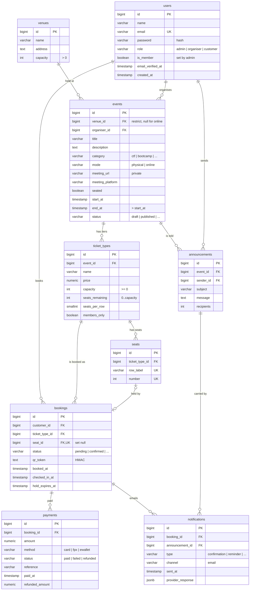

# Entity relationship diagram (Mermaid)

The same nine domain tables as [`ERD.png`](ERD.png) / [`ERD.svg`](ERD.svg), written as Mermaid so it renders on GitHub, in VS Code (Markdown preview) and at https://mermaid.live (paste the code from [`ERD.mmd`](ERD.mmd)).

Laravel's own tables (personal_access_tokens, sessions, cache, jobs) are left out.

## Reading the diagram

- `||--o{` is one-to-many: one row on the left relates to zero or more rows on the right. `|o--o|` is zero-or-one to zero-or-one.
- `PK` primary key, `FK` foreign key, `UK` unique.
- Every foreign key is cascade-deleted except `events.venue_id` (restrict) and `bookings.seat_id` (set null).
- A seat can belong to at most one booking (`bookings.seat_id` is unique), and a booking has at most one seat (online and unnumbered events have none).
